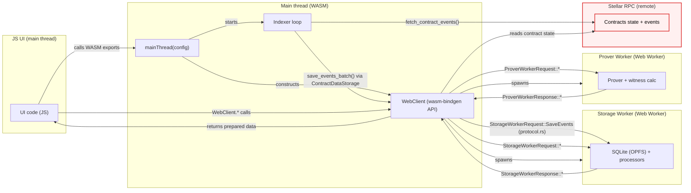

# App Architecture

This document describes how the application manages local state, including persistent storage and on-chain data.

## Overview

**Core vs platforms**

Core application logic is implemented in Rust `app/crates/core` crates which define sync and async primitives and building blocks.
Platforms `app/crates/platforms` (`web`, in the future - `cli`, `mcp` etc) provide compilation target specific dependencies, setup runtime (asynchronous/threaded), ui interaction protocol (e.g. FFI/http), order of operations.

Other directories in `app` directory mostly define interfaces for the `web` platform but probably can be restructured in the future to include other platforms interfaces as well.

**Storage:**

Local storage is implemented upon SQLite (`app/crates/core/state/src/storage.rs`) with the schema `app/crates/core/state/src/schema.sql` to have a unified storage across different platforms allowing future data syncs across platforms.

## Web platform (WASM + Web Workers)

The `web` platform runs Rust application logic in the browser via WASM, with heavy and/or blocking work offloaded to Web Workers.

### Components

**JS UI (main thread)**

The UI is written in JavaScript and calls into the WASM bundle. It does not communicate with workers directly.

**Main thread (WASM)**

- Entry point is `mainThread(config)` (WASM export).
- Initializes logging / panic hooks, constructs `WebClient`, and starts an indexer polling loop.

**Indexer (core Rust)**

- The indexer is generic over a storage backend (`Indexer<S: ContractDataStorage>`).
- On web, the storage backend is `WebClient`, which implements the `ContractDataStorage` trait by forwarding calls to the Storage Worker.
- The indexer polls Stellar RPC for contract events and persists them as raw events.

**`WebClient` (WASM, wasm-bindgen API)**

- `WebClient` is the only Rust API exposed to JS, via `#[wasm_bindgen]` methods.
- Spawns both workers and performs request/response routing internally; JS never constructs or sends worker protocol messages.
- Implements the worker communication protocol defined in `protocol.rs`.

**Storage Worker (Web Worker)**

- Owns local persistent state: SQLite via OPFS-backed VFS (browser storage).
- Performs local “logic operations”: saving raw events, processing events, scanning/decrypting notes, and maintaining derived state.
- Designed to stay responsive by processing in small chunks and yielding between batches.

**Prover Worker (Web Worker)**

- Runs long/blocking proving so it cannot block the Storage Worker’s background processing or other app requests from the main thread.
- Does not persist any user state; it loads/caches proving artifacts in memory and returns proof results.

### Worker protocol and isolation

The Rust `web` platform crate owns worker spawning and communication. Worker messages are strongly typed and serialized using enums in `protocol.rs` (e.g. `StorageWorkerRequest/Response`, `ProverWorkerRequest/Response`). This protocol is intentionally not exposed to JS.

### Data flow (high level)

**Keypair Derivation:**

Keys are derived deterministically from Freighter wallet signatures:
1. User signs the message defined by `KEY_DERIVATION_MESSAGE` from `app/crates/core/prover/src/encryption.rs`
2. The app derives the BN254 note identity keypair and the X25519 encryption keypair from that single signature using separate domain-separated hashes

**When are signatures prompted?**

At the user onboarding to allow to scan for notes addressed to the user. The derived keys are stored permanently.

### Public Key Store

Maintains an address book of registered public keys in the pool contract for sending private transfers.

## Recovery Scenarios

### Clearing Browser Data

All stored data is lost. On next load:
1. Full sync from RPC (limited by RPC retention window, typically [7 days](https://developers.stellar.org/docs/data/apis/rpc)).
2. Merkle trees rebuilt from synced events.
3. User must re-authenticate for keypair derivation.
4. Note scanning rediscovers received notes.
5. If events are older than retention window, they cannot be recovered.

### Account Switch

If the keys derivation is required, a user will be asked for that. From that moment on, this new account is as well used to scan new notes in the background events processing.
